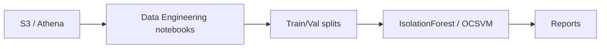
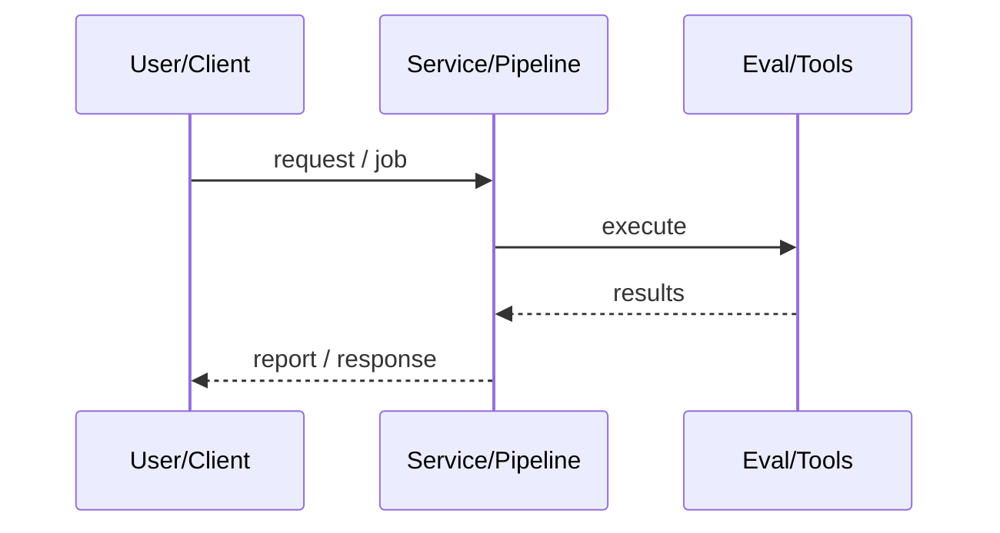
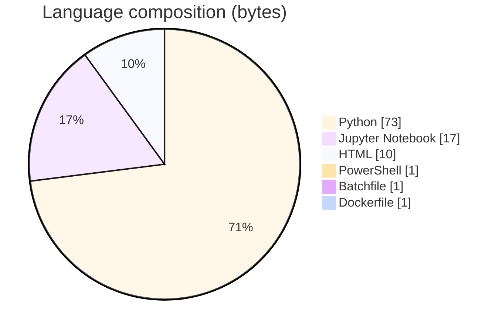

# CyberSentinel Security Solutions

### MSADS 508 cyber analytics project: AWS data lake notebooks + Isolation Forest / One-Class SVM exploration (repo currently vendors a local venv).

[](https://github.com/ArchanaChetan07/CyberSentinel-Security-Solutions)
[](https://github.com/ArchanaChetan07/CyberSentinel-Security-Solutions)
[](https://github.com/ArchanaChetan07/CyberSentinel-Security-Solutions)
[](https://github.com/ArchanaChetan07/CyberSentinel-Security-Solutions/actions)

---

## Overview

Security operations need scalable ingestion and anomaly detection over large labeled event datasets hosted in cloud warehouses.

Course notebooks for S3/Athena data prep, balancing/splits, and sklearn anomaly models (Isolation Forest, One-Class SVM) with Docker compose stubs under infrastructure/.

Educational pipeline artifacts; measured anomaly-class recall in notebook outputs is low (e.g., ~0.04–0.08)—not the marketing “≥90% detect” claim.

This repository is maintained as **production-minded portfolio work**: clear architecture, automated checks where present, and metrics that are **traceable to committed artifacts** (never invented).

---

## Architecture

S3/Athena extracts → cleaning/balancing notebooks → IsolationForest/OCSVM → classification reports





---

## Results & repository facts

> Only values found in code, configs, tests, or generated reports are listed. Absence of a clinical/ML accuracy number means it was **not** published in-repo.

| Metric | Value | Source |
|---|---|---|
| Isolation Forest overall accuracy (full scored set) | **0.23** | `Models/Final Project Code.ipynb` |
| One-Class SVM anomaly-class recall (test) | **0.08** | `Models/Final Project Code.ipynb` |
| One-Class SVM anomaly-class precision (test) | **0.91** | `Models/Final Project Code.ipynb` |
| Non-venv source-ish blobs | **~29** | `git tree main (excluding venv/)` |
| Tracked files | **1505** | `git tree` |
| Python modules | **717** | `git tree` |
| Test-related paths | **15** | `git tree` |
| CI workflows | **Yes** | `.github/workflows` |
| Docker present | **Yes** | `repo root` |



---

## Key features

- Data engineering notebooks (Combine Data, Athena, S3)
- Train/validation balancing notebook
- Anomaly detection modeling notebook
- Docker infrastructure skeleton
- CI workflow present

---

## Tech stack

| Layer | Technology |
|---|---|
| language | Python |
| cloud | AWS S3 / Athena / SageMaker (notebooks) |
| ml | Isolation Forest / One-Class SVM |
| infra | Docker Compose stub |
| notebooks | Jupyter |

---

## Skills demonstrated

Python · pandas · scikit-learn · AWS Athena/S3/SageMaker (course) · Docker · CI/CD · testing · automation

Keyword surface: **Python · Python · machine-learning · CI/CD · testing · API · Docker · automation · data-science · software-engineering · system-design · observability · LLM · cloud**

---

## Project structure

```text
CyberSentinel-Security-Solutions/
├── Models/Final Project Code.ipynb
├── data/*.ipynb
├── scripts/*.ipynb
├── infrastructure/Docker/
├── requirements.txt
└── venv/  (should not be in VCS)
```

---

## Installation & usage

```bash
git clone https://github.com/ArchanaChetan07/CyberSentinel-Security-Solutions.git
cd CyberSentinel-Security-Solutions
pip install -r requirements.txt
jupyter notebook "Models/Final Project Code.ipynb"
```

---

## How it works

Notebooks pull or assemble security telemetry, prepare unbalanced labels, fit unsupervised anomaly detectors, and print sklearn classification reports against available labels.

---

## Future improvements

- Remove committed venv/ to shrink repo
- Replace inflated README metrics with notebook-backed numbers
- Productionize scoring API separate from course notebooks

---

## License

See repository.

---

<p align="center">
  <b>CyberSentinel Security Solutions</b><br/>
  <a href="https://github.com/ArchanaChetan07/CyberSentinel-Security-Solutions">github.com/ArchanaChetan07/CyberSentinel-Security-Solutions</a>
</p>
