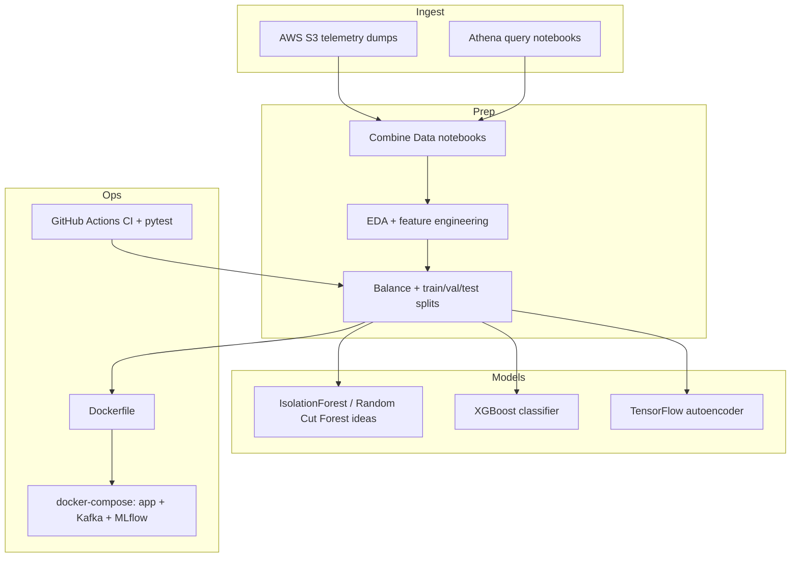
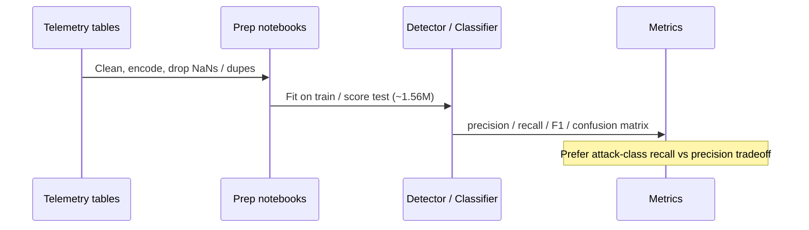

# CyberSentinel Security Solutions

### Large-scale network intrusion / DDoS anomaly detection on multi-million event telemetry

[](https://github.com/ArchanaChetan07/CyberSentinel-Security-Solutions/actions/workflows/ci.yml)
[](https://www.python.org/)
[](Models/Final%20Project%20Code.ipynb)
[](infrastructure/Docker/docker-compose.yml)

End-to-end cybersecurity analytics system that ingests Defender-style network telemetry (S3 / Athena notebooks), engineers features at scale, balances train/validation/test splits, and benchmarks **unsupervised anomaly detectors** against **supervised boosting** and a **reconstruction autoencoder**. Built for security-oriented ML evaluation where **attack-class precision/recall tradeoffs** matter more than headline accuracy.

---

## Impact Snapshot

| Signal | Verified value | Evidence |
|---|---|---|
| Events scored (Isolation Forest, full clean set) | **4,477,323** | `Models/Final Project Code.ipynb` classification report |
| Held-out test rows (model comparison) | **1,556,042** | same notebook reports |
| Best attack precision (Isolation Forest default) | **0.91** (recall **0.08**) | IF test report |
| Best balanced IF (cleaned features) | attack P **0.88** / R **0.16** / Acc **0.52** | IF cleaned report |
| XGBoost attack recall | **1.00** (precision **0.56**, Acc **0.56**) | XGBoost report |
| Autoencoder attack precision | **0.81** (recall **0.07**) | Autoencoder report |
| Unit tests | **7** | `tests/test_cybersentinel_security_so.py` |
| Runtime packaging | Dockerfile + Compose (`app`, Kafka, ZooKeeper, MLflow) | `infrastructure/Docker/` |

> Accuracy alone is misleading on this label mix (~44% / ~56% on the 1.56M test split). Prefer **attack precision, attack recall, and confusion matrices** when reviewing results.

---

## Model Comparison (attack class = label `1`)

```mermaid
xychart-beta
    title Attack-class metrics on 1.56M test rows
    x-axis [IF_P0.91, IF_clean, XGBoost, Autoencoder]
    y-axis "Score" 0 --> 1
    bar [0.91, 0.88, 0.56, 0.81]
    bar [0.08, 0.16, 1.00, 0.07]
```



| Model | Attack precision | Attack recall | Accuracy | Notes |
|---|---:|---:|---:|---|
| Isolation Forest (default scores) | 0.91 | 0.08 | 0.49 | High precision, low coverage |
| Isolation Forest (cleaned / tuned) | 0.88 | 0.16 | 0.52 | Better recall, still conservative |
| XGBoost | 0.56 | **1.00** | 0.56 | Catches essentially all attacks; more FPs |
| Autoencoder | 0.81 | 0.07 | ~0.48 | Strong precision, low recall |

---

## System Architecture



**Evaluation flow**



---

## Engineering Skills Demonstrated

Python · pandas/numpy · scikit-learn · XGBoost · TensorFlow · anomaly detection · class imbalance · large-scale evaluation · AWS S3/Athena (notebook path) · Docker · docker-compose · Kafka (compose service) · MLflow (compose service) · pytest · GitHub Actions · cybersecurity ML evaluation design

---

## Repository Layout

```text
CyberSentinel-Security-Solutions/
├── Models/Final Project Code.ipynb     # primary model bake-off + reports
├── scripts/                            # engineering, EDA, splits, modeling
├── data/                               # S3/Athena/combine/EDA notebooks
├── infrastructure/Docker/              # Dockerfile + docker-compose.yml
├── tests/test_cybersentinel_security_so.py
├── requirements.txt
└── .github/workflows/ci.yml
```

Empty stubs (`app/`, `dashboards/`, `Monitoring/`) reserve product surfaces; notebooks + Docker are the delivered core today.

---

## Quick Start

```bash
git clone https://github.com/ArchanaChetan07/CyberSentinel-Security-Solutions.git
cd CyberSentinel-Security-Solutions

python -m venv .venv
# Windows: .venv\Scripts\activate
source .venv/bin/activate

pip install pandas numpy scikit-learn xgboost tensorflow matplotlib seaborn pytest
jupyter notebook "Models/Final Project Code.ipynb"
pytest tests/ -q
```

```bash
cd infrastructure/Docker
docker compose up --build
```

Compose wires `app`, `kafka`, `zookeeper`, and `mlflow`. Treat it as an infrastructure scaffold — customize the app command for a long-running API before production use.

---

## Design Notes

1. **Scale first:** reports are computed on **millions** of rows, not toy CSVs.
2. **Security metric framing:** a model with 0.91 attack precision and low recall is a different operational choice than XGBoost’s near-perfect recall.
3. **Honest packaging:** `requirements.txt` lists a broad security/ML toolkit; install the subset you need for the notebook path you run.
4. **Hygiene:** a committed `venv/` exists in git history — prefer a fresh local virtualenv and do not depend on the bundled environment.

---

## Future Work

- Persist best thresholds as versioned model cards with cost matrices (FP SOC load vs missed attacks)
- Replace notebook-only scoring with a FastAPI scoring service + feature store contract
- Strip `venv/` from version control and pin a lockfile for reproducible CI training smoke tests

---

## License

See repository license file if present.
