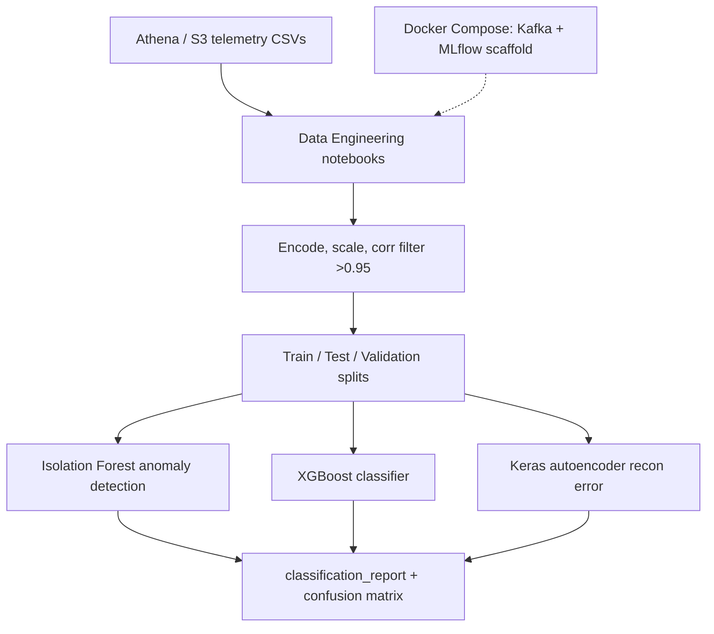

# CyberSentinel Security Solutions

### ML anomaly detection for network intrusion / DDoS — Defender-style telemetry notebooks, Isolation Forest + XGBoost, Docker scaffold

[](https://github.com/ArchanaChetan07/CyberSentinel-Security-Solutions/actions/workflows/ci.yml)
[](https://www.python.org/)
[](tests/test_cybersentinel_security_so.py)
[](infrastructure/Docker/)
[](#license)

Notebook-led security analytics pipeline for **network intrusion and DDoS detection** on Defender-style telemetry: AWS Athena/S3 ingest, feature engineering, Isolation Forest / XGBoost / Keras autoencoder experiments, and train–test–validation splits. `app/`, `dashboards/`, and `Monitoring/` are placeholder scaffolds (`.gitkeep` only).

---

## Key Results

| Metric | Value | Source |
|---|---|---|
| Jupyter notebooks | **11** | repo root + `data/`, `scripts/`, `Models/` |
| Unit tests | **7** | `tests/test_cybersentinel_security_so.py` |
| Full-dataset Isolation Forest rows | **4,477,323** | `Models/Final Project Code.ipynb` output |
| Isolation Forest accuracy (full set) | **0.23** | same notebook classification report |
| Test-set rows | **1,556,042** | same notebook (692,705 normal / 863,337 attack) |
| Isolation Forest test accuracy | **0.49** | `Models/Final Project Code.ipynb` (contamination=0.05) |
| XGBoost test accuracy | **0.56** | same notebook (attack recall **1.00**, precision **0.56**) |
| S3 data bucket | `msads-508-sp25-team6` | notebook downloads Train/Test/Validation CSV |
| Docker services | **4** (app, Kafka, Zookeeper, MLflow) | `infrastructure/Docker/docker-compose.yml` |
| Deployed API / Prometheus | **None** (requirements only) | no FastAPI app or metrics exporter in repo |

**Note:** A committed `venv/` inflates GitHub file counts (~1,400 vendor files). Prefer a fresh virtualenv from `requirements.txt`.

---

## Architecture



**How it works:** `data/` notebooks connect to AWS Athena and download Defender-style network flow features. `scripts/Data Engineering.ipynb` cleans duplicates, imputes missing values, drops highly correlated numeric columns (>0.95), and scales features. `Models/Final Project Code.ipynb` trains Isolation Forest (contamination 0.05–0.10), tunes decision thresholds, compares XGBoost and a Keras autoencoder on the held-out test split, and logs confusion matrices. CI runs lightweight sklearn smoke tests that assert anomaly detection and classifier accuracy above baseline on synthetic data.

---

## Tech Stack

| Layer | Choice |
|---|---|
| Language | Python 3.10 |
| ML | scikit-learn (IsolationForest, RandomForest), XGBoost, TensorFlow/Keras autoencoder |
| Data | pandas, numpy, AWS Athena/S3 (boto3, awswrangler in notebooks) |
| Viz | matplotlib, seaborn |
| Packaging | Docker + docker-compose (Kafka, Zookeeper, MLflow) |
| CI | GitHub Actions + pytest + flake8 |

---

## Features

- Multi-notebook ELT: Athena queries, S3 CSV download, combine & exploration
- Anomaly models: Isolation Forest, Random Cut Forest patterns, autoencoder reconstruction error
- Supervised baseline: XGBoost on balanced train/test/validation CSVs
- Feature pipeline: median imputation, categorical encoding, StandardScaler, correlation pruning
- Synthetic pytest coverage for IP byte features, label encoding, and IsolationForest detection
- Docker Compose skeleton for Kafka streaming + MLflow tracking (no production app wired)

---

## Installation & Usage

```bash
git clone https://github.com/ArchanaChetan07/CyberSentinel-Security-Solutions.git
cd CyberSentinel-Security-Solutions
python -m venv .venv && source .venv/bin/activate   # Windows: .venv\Scripts\activate
pip install -r requirements.txt
pytest tests/ -v
```

Open `Models/Final Project Code.ipynb` or the `scripts/` notebooks for the full modeling workflow. AWS credentials are required for Athena/S3 cells.

Optional Docker scaffold:

```bash
cd infrastructure/Docker
docker compose up --build
```

---

## Repository Layout

| Path | Purpose |
|---|---|
| `data/` | Athena, S3 download, exploration notebooks |
| `scripts/` | Engineering, balancing, modeling notebooks |
| `Models/` | Final project notebook + exported HTML/PDF |
| `tests/` | sklearn smoke tests |
| `infrastructure/Docker/` | Dockerfile + compose (Kafka, MLflow) |
| `app/`, `dashboards/`, `Monitoring/` | Placeholder scaffolds |

---

## License

See repository license file if present.
