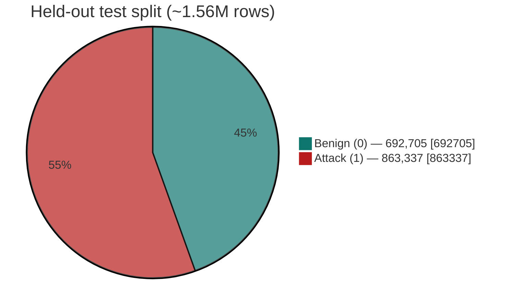
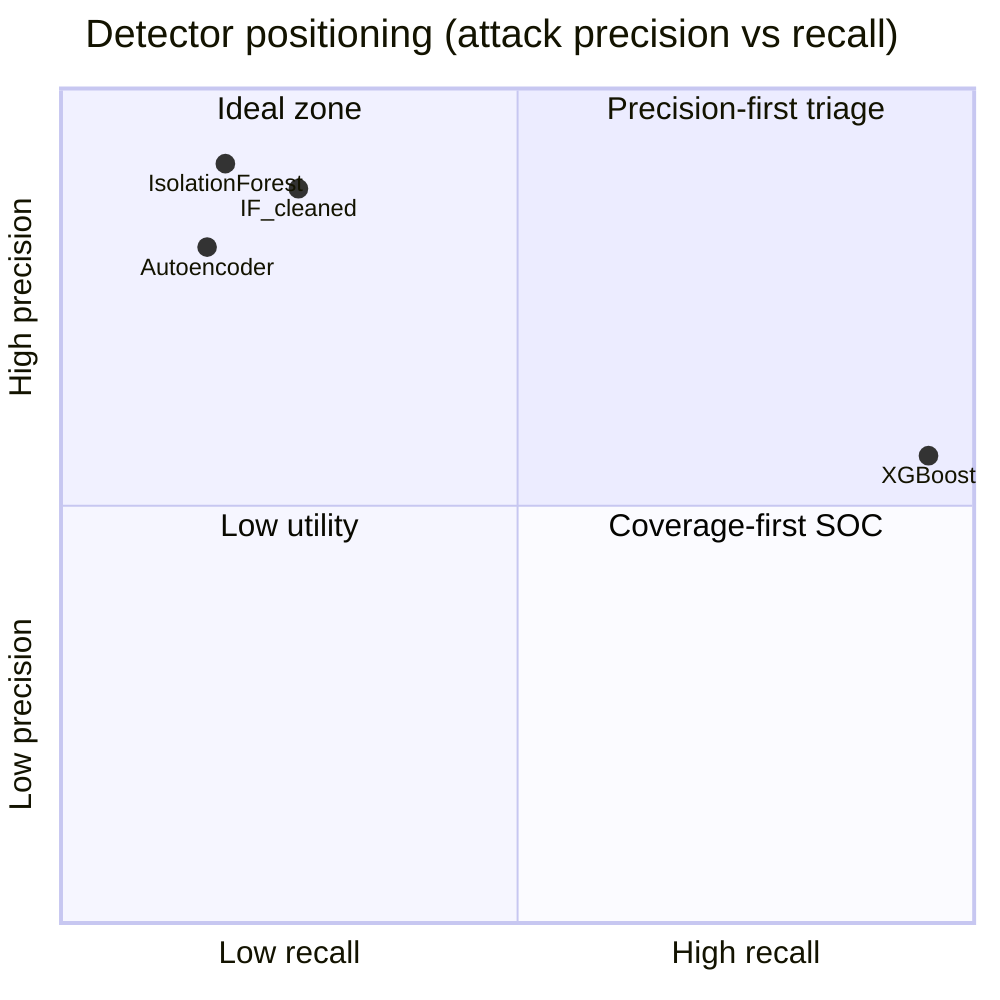
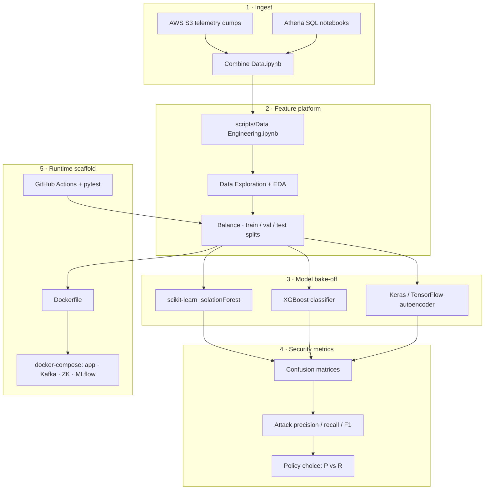
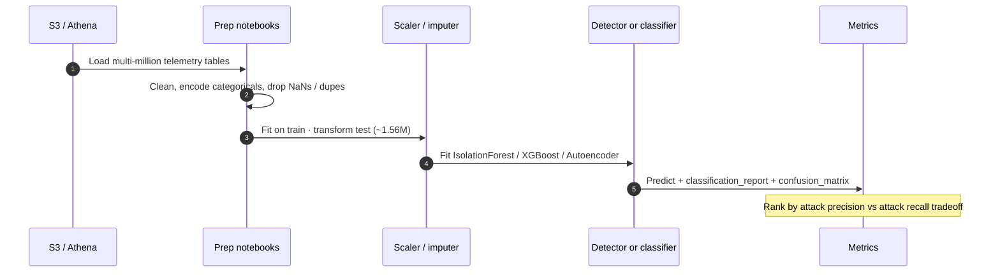
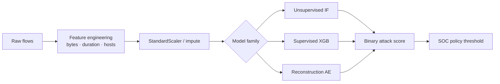
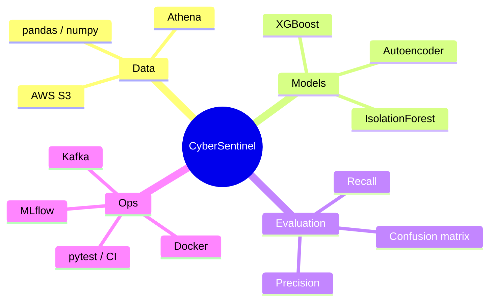

# CyberSentinel Security Solutions

### Large-scale network intrusion & DDoS anomaly detection on **4.5M+** telemetry events

[](https://github.com/ArchanaChetan07/CyberSentinel-Security-Solutions/actions/workflows/ci.yml)
[](https://www.python.org/)
[](https://scikit-learn.org/)
[](https://xgboost.readthedocs.io/)
[](https://www.tensorflow.org/)
[](https://aws.amazon.com/)
[](infrastructure/Docker/docker-compose.yml)
[](tests/test_cybersentinel_security_so.py)

> **Production-scale cybersecurity ML**: ingest Defender-style network telemetry from **AWS S3 / Athena**, engineer features at million-row scale, then bake off **Isolation Forest**, **XGBoost**, and a **TensorFlow reconstruction autoencoder** — evaluated on **attack-class precision / recall**, not vanity accuracy.

**Evidence notebook:** [`Models/Final Project Code.ipynb`](Models/Final%20Project%20Code.ipynb)  
**Live repo:** [github.com/ArchanaChetan07/CyberSentinel-Security-Solutions](https://github.com/ArchanaChetan07/CyberSentinel-Security-Solutions)

---

## Impact Snapshot (verified)

| Signal | Number | Source |
|---|---|---|
| Events scored (Isolation Forest, full clean run) | **4,477,323** | notebook classification support |
| Held-out test rows (model comparison) | **1,556,042** | IF / XGB / AE reports |
| Attack support in test split (label `1`) | **863,337** | classification reports |
| Benign support in test split (label `0`) | **692,705** | classification reports |
| Best attack **precision** (Isolation Forest) | **0.91** (recall **0.08**) | IF default |
| Best balanced IF (cleaned features) | P **0.88** · R **0.16** · Acc **0.52** | IF cleaned |
| Best attack **recall** (XGBoost) | **1.00** (precision **0.56**, Acc **0.56**) | XGBoost |
| Autoencoder attack precision | **0.81** (recall **0.07**) | AE report |
| Unit tests | **7** | `tests/test_cybersentinel_security_so.py` |
| Runtime stack | Docker Compose · Kafka · ZooKeeper · MLflow | `infrastructure/Docker/` |



> On this mix (~44% benign / ~56% attack), **overall accuracy is a weak ranking signal**. Prefer **attack precision**, **attack recall**, and **confusion matrices** when comparing detectors.

---

## Model Bake-Off — Attack Class (`label = 1`)

```mermaid
xychart-beta
    title Attack precision on 1,556,042 test rows
    x-axis [IsolationForest, IF_cleaned, XGBoost, Autoencoder]
    y-axis "Precision" 0 --> 1
    bar [0.91, 0.88, 0.56, 0.81]
```

```mermaid
xychart-beta
    title Attack recall on 1,556,042 test rows
    x-axis [IsolationForest, IF_cleaned, XGBoost, Autoencoder]
    y-axis "Recall" 0 --> 1
    bar [0.08, 0.16, 1.00, 0.07]
```

```mermaid
xychart-beta
    title Overall accuracy (context only — prefer attack metrics)
    x-axis [IsolationForest, IF_cleaned, XGBoost]
    y-axis "Accuracy" 0 --> 1
    bar [0.49, 0.52, 0.56]
```

| Model | Attack precision | Attack recall | Attack F1 | Accuracy | Operational read |
|---|---:|---:|---:|---:|---|
| **Isolation Forest** (contamination 0.05) | **0.91** | 0.08 | 0.15 | 0.49 | High-precision triage; misses many attacks |
| **Isolation Forest** (cleaned / contamination 0.1) | 0.88 | **0.16** | 0.27 | **0.52** | Better coverage; still conservative |
| **XGBoost** | 0.56 | **1.00** | 0.71 | **0.56** | Near-complete attack capture; higher false positives |
| **TensorFlow Autoencoder** | **0.81** | 0.07 | 0.13 | ~0.48 | Strong precision; low coverage |

### Confusion matrices (from notebook)

**Isolation Forest (default scores)** — test `1,556,042`

|  | Pred benign | Pred attack |
|---|---:|---:|
| **True benign** | 685,554 | 7,151 |
| **True attack** | 792,910 | 70,427 |

**Isolation Forest (cleaned)** — test `1,556,042`

|  | Pred benign | Pred attack |
|---|---:|---:|
| **True benign** | 673,873 | 18,832 |
| **True attack** | 726,696 | 136,641 |

**XGBoost** — test `1,556,042`

|  | Pred benign | Pred attack |
|---|---:|---:|
| **True benign** | 1,885 | 690,820 |
| **True attack** | 218 | 863,119 |



---

## Problem Statement

Security operations receive **multi-million-event** network flows. Headline accuracy collapses under class imbalance and cost asymmetry: a false positive burns analyst time; a false negative ships an undetected DDoS or intrusion.

CyberSentinel answers:

1. Can **unsupervised** anomaly detection (Isolation Forest / RCF-style) flag attacks at usable precision on **>1.5M** held-out events?  
2. How does that trade off against **supervised XGBoost** and a **deep autoencoder**?  
3. How do we frame evaluation so a security team can pick a **precision-first vs recall-first** policy?

---

## System Architecture



### End-to-end evaluation flow



### Data → model pipeline (logical)



---

## Engineering Surface

| Layer | What you will find |
|---|---|
| **Cloud data path** | `data/S3 Bucket Connection…`, `data/Athena Database.ipynb`, combine notebooks |
| **Prep at scale** | `scripts/Data Engineering.ipynb`, exploration, balancing & splits |
| **Primary bake-off** | `Models/Final Project Code.ipynb` (+ HTML/PDF exports) |
| **Infra** | `infrastructure/Docker/Dockerfile`, `docker-compose.yml` (app, Kafka, ZooKeeper, MLflow) |
| **Quality** | `tests/test_cybersentinel_security_so.py` — feature, scale, IF & classifier smoke tests |
| **CI** | `.github/workflows/ci.yml` — Python 3.10, pytest |



---

## Skills & Keywords

`Python` · `pandas` · `NumPy` · `scikit-learn` · `Isolation Forest` · `XGBoost` · `TensorFlow` / `Keras` · `autoencoder` · `anomaly detection` · `network intrusion detection` · `DDoS` · `class imbalance` · `precision-recall tradeoff` · `confusion matrix` · `feature engineering` · `StandardScaler` · `train/validation/test splits` · `AWS S3` · `Amazon Athena` · `Docker` · `docker-compose` · `Apache Kafka` · `MLflow` · `pytest` · `GitHub Actions` · `cybersecurity machine learning` · `large-scale evaluation (1.5M–4.5M rows)`

---

## Repository Layout

```text
CyberSentinel-Security-Solutions/
├── Models/
│   ├── Final Project Code.ipynb      ← primary bake-off + reports
│   ├── Final Project Code.html
│   └── Final Project Code.pdf
├── scripts/
│   ├── Data Engineering.ipynb
│   ├── Data Exploration.ipynb
│   ├── Data Preparation Balancing and Test Train Validation Splits.ipynb
│   └── Data_Modeling (2).ipynb
├── data/
│   ├── Athena Database.ipynb
│   ├── Combine Data.ipynb
│   ├── Data Exploration.ipynb
│   └── S3 Bucket Connection & Local File Download-checkpoint.ipynb
├── infrastructure/Docker/
│   ├── Dockerfile
│   └── docker-compose.yml            ← app + kafka + zookeeper + mlflow
├── tests/test_cybersentinel_security_so.py
├── .github/workflows/ci.yml
├── requirements.txt
├── Combine Data.ipynb
└── README.md
```

`app/`, `dashboards/`, and `Monitoring/` are reserved product surfaces; the **delivered core** today is notebooks + metrics + Docker scaffold.

---

## Quick Start

```bash
git clone https://github.com/ArchanaChetan07/CyberSentinel-Security-Solutions.git
cd CyberSentinel-Security-Solutions

python -m venv .venv
# Windows PowerShell
.\.venv\Scripts\Activate.ps1
# macOS / Linux
source .venv/bin/activate

pip install pandas numpy scikit-learn xgboost tensorflow matplotlib seaborn pytest
jupyter notebook "Models/Final Project Code.ipynb"
pytest tests/ -q
```

### Runtime scaffold

```bash
cd infrastructure/Docker
docker compose up --build
```

Compose brings up `app` (`:8000`), `kafka` (`:9092`), `zookeeper` (`:2181`), and `mlflow` (`:5000`). Treat this as an **infrastructure skeleton** — wire a long-running scoring API before production traffic.

---

## Design Decisions

1. **Scale is the point** — reports cover **4,477,323** scored events and **1,556,042** held-out rows, not toy CSVs.  
2. **Security framing over accuracy** — IF @ **0.91** precision / **0.08** recall is a different SOC policy than XGBoost @ **1.00** recall / **0.56** precision.  
3. **Unsupervised vs supervised vs deep** — three families, one shared test set, transparent confusion matrices.  
4. **Honest packaging** — `requirements.txt` is a broad ML/security toolkit; install the subset your notebook path needs. Prefer a fresh `.venv` over any historically committed `venv/` tree.

---

## Roadmap

- Versioned model cards with **cost matrices** (SOC FP load vs missed attacks)  
- FastAPI scoring service + feature contract replacing notebook-only inference  
- Remove committed `venv/` from history and pin a lockfile for reproducible CI smoke trains  

---

## Author

**Archana Chetan** · [@ArchanaChetan07](https://github.com/ArchanaChetan07)

Built to demonstrate end-to-end **security ML systems work**: cloud telemetry, large-scale prep, multi-model evaluation, and containerized MLOps scaffolding.

---

## License

See repository license file if present. All reported metrics above are taken from executed notebook outputs in this repository and are **not altered**.
